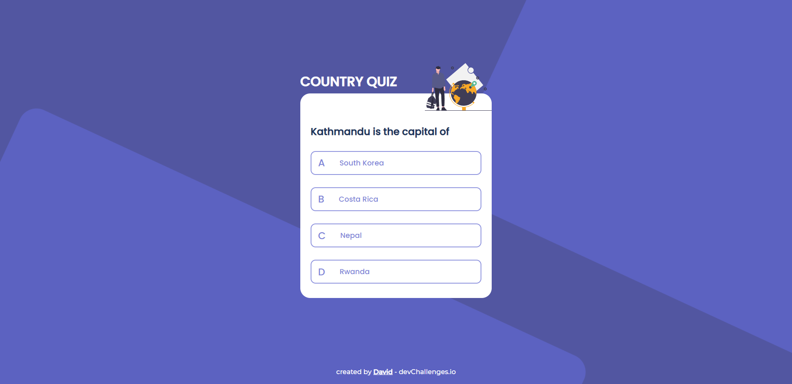

<!-- Please update value in the {}  -->

<h1 align="center">Country quiz</h1>

<div align="center">
   Solution for a challenge from  <a href="http://devchallenges.io" target="_blank">Devchallenges.io</a>.
</div>

<div align="center">
  <h3>
    <a href="https://trusting-mestorf-46bfb4.netlify.app/">
      Demo
    </a>
    <span> | </span>
    <a href="https://devchallenges.io/solutions/6C7j6PeZLWblWN4LC263">
      Solution
    </a>
    <span> | </span>
    <a href="https://devchallenges.io/challenges/Bu3G2irnaXmfwQ8sZkw8">
      Challenge
    </a>
  </h3>
</div>

<!-- TABLE OF CONTENTS -->

## Table of Contents

- [Overview](#overview)
  - [Built With](#built-with)
- [Features](#features)
- [How to use](#how-to-use)
- [Contact](#contact)
- [Acknowledgements](#acknowledgements)

<!-- OVERVIEW -->

## Overview



- Where can I see your demo?  
Right here :D : https://devchallenges.io/solutions/6C7j6PeZLWblWN4LC263
- What was your experience?  
Pretty fun to develop a simple Quiz app with a polished design.
- What have you learned/improved?
I improved my state management and integration skills. I learned about geolocation and permissions handling.
- Your wisdom? :)

### Built With
- [React](https://reactjs.org/)
- [Material Icons](https://mui.com/components/material-icons/)

## Features

This application/site was created as a submission to a [DevChallenges](https://devchallenges.io/challenges) challenge. The [challenge](https://devchallenges.io/challenges/Bu3G2irnaXmfwQ8sZkw8) was to build an application to complete the given user stories.
* User story: I can see at least 2 types of questions: a city is the capital of.. or a flag belong to country..
* User story: I can see select an answer
* User story: I can see if my answer is correct or incorrect
* User story: When I answer correctly, I can move on to the next question
* User story: When I answer incorrectly, I can see my results and try again
* User story: I can try again

## How To Use

<!-- Example: -->

To clone and run this application, you'll need [Git](https://git-scm.com) and [Node.js](https://nodejs.org/en/download/) (which comes with [npm](http://npmjs.com)) installed on your computer. From your command line:

```bash
# Clone this repository
$ git clone https://github.com/david-dkp/CountryQuiz.git

# Install dependencies
$ npm install

# Run the app
$ npm start
```

## Contact

- Website [dekeuwerdavid.fr](https://dekeuwerdavid.fr)
- GitHub [@david-dkp](https://github.com/david-dkp)
- LinkedIn [David Dekeuwer](https://www.linkedin.com/in/david-dekeuwer-1940a01b9/)
